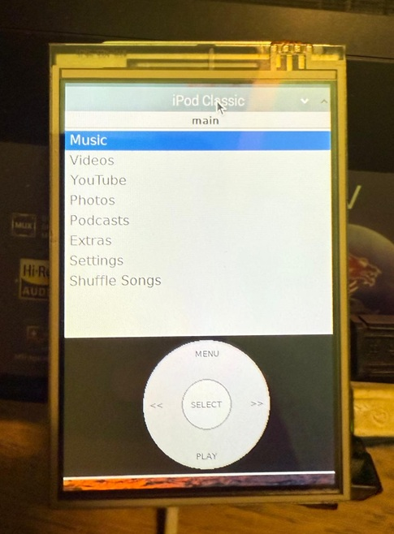
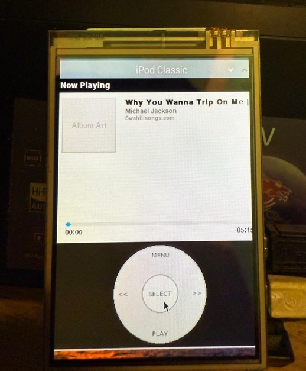

# iPod Classic Music Player

A Python music player that emulates the classic iPod interface using Pygame, specially designed for Raspberry Pi Zero but compatible with any system.
## Visual Documentation


*Description of first image*


*Description of second image*
## 🎵 Features

### Authentic iPod Classic Interface
- **iPod Classic 6th Gen UI**: Faithful interface design with authentic colors and fonts
- **Functional Click Wheel**: Simulated touch wheel with Menu, Play/Pause, Forward, Backward, and center buttons
- **2.8" Display**: 358x269 resolution simulating the original iPod screen
- **Smooth Animations**: Transitions and animations just like the real iPod

### Music Features
- **Music Library**: Automatic scanning of MP3, WAV, OGG, FLAC, M4A, AAC files
- **Browse by Artist/Album/Songs**: Complete music organization
- **Cover Flow**: Album view with visual navigation (like real iPod Classic)
- **Playback Controls**: Play, pause, next, previous, shuffle, repeat
- **Volume Control**: Integrated volume adjustment
- **Now Playing**: Current playback screen with progress bar

### Multimedia Features
- **Video Player**: Support for local video files
- **YouTube Player**: 
  - Video search with iPod virtual keyboard
  - Trending music videos
  - YouTube video playback
- **Playlists**: Basic playlist support

### Connectivity
- **WiFi Manager**: WiFi network connection and management
- **SQLite Database**: Efficient music metadata storage

### Optimized for Raspberry Pi
- **Auto Boot**: Runs automatically on startup
- **Console Mode**: Works without desktop environment
- **Low Power**: Optimized for Raspberry Pi Zero
- **Framebuffer**: Direct screen output without X11

## 📦 Installation

### Quick Install on Raspberry Pi

```bash
# Clone the repository
git clone https://github.com/your-username/pygame-music-player.git
cd pygame-music-player

# Run the automatic installer
chmod +x quick_install_pi.sh
./quick_install_pi.sh

# Reboot to apply changes
sudo reboot
```

### Complete Installation on Raspberry Pi

```bash
# For complete installation with all optimizations
chmod +x install_pi.sh
./install_pi.sh
sudo reboot
```

### Manual Installation

1. **Clone the repository:**
   ```bash
   git clone https://github.com/your-username/pygame-music-player.git
   cd pygame-music-player
   ```

2. **Create virtual environment:**
   ```bash
   python3 -m venv venv
   source venv/bin/activate  # On Windows: venv\Scripts\activate
   ```

3. **Install dependencies:**
   ```bash
   pip install -r requirements.txt
   ```

4. **Add music:**
   - Create a `music` folder in the project directory
   - Or place music in `~/Music`
   - Supported formats: MP3, WAV, OGG, FLAC, M4A, AAC

5. **Run:**
   ```bash
   python src/main.py
   ```

## 🎮 Controls

### Keyboard (Development/PC)
- **Arrow Keys ↑↓ or W/S**: Navigate menus
- **Enter/Space**: Select item
- **Escape/Backspace**: Go back/Previous menu
- **In Now Playing:**
  - A/← : Previous song
  - D/→ : Next song  
  - P: Play/Pause
  - V: Volume control

### Click Wheel (Mouse/Touch)
- **Outer wheel**: Slide to navigate
- **Center button**: Select
- **Top button (Menu)**: Go back
- **Bottom button (Play)**: Play/Pause
- **Side buttons**: Previous/Next

## 📁 Project Structure

```
pygame-music-player/
├── src/
│   ├── main.py              # Main application
│   ├── database.py          # SQLite database management
│   ├── playback.py          # Playback control
│   ├── renderer.py          # iPod rendering engine
│   ├── ui_config.py         # iPod Classic visual configuration
│   ├── menu_manager.py      # Menu and navigation management
│   ├── music_controller.py  # Music controller
│   ├── click_wheel.py       # Click Wheel implementation
│   ├── cover_flow.py        # Cover Flow view
│   ├── video_player.py      # Video player
│   ├── youtube_manager.py   # YouTube management
│   ├── youtube_player.py    # YouTube player
│   ├── wifi_manager.py      # WiFi management
│   └── input_handler.py     # Input handling
├── music/                   # Local music directory
├── videos/                  # Local videos directory
├── assets/                  # Resources (fonts, images)
├── install_pi.sh           # Complete installer for Pi
├── quick_install_pi.sh     # Quick installer for Pi
├── requirements.txt        # Python dependencies
└── README.md              # This file
```

## 🛠️ Dependencies

### Python
- `pygame-ce>=2.1.0` - Enhanced graphics engine
- `mutagen>=1.45.0` - Audio metadata
- `ffpyplayer>=4.3.0` - Video playback
- `yt-dlp>=2023.11.16` - YouTube support
- `requests>=2.31.0` - HTTP requests

### System (Raspberry Pi)
- `python3-pygame` - System Pygame
- `alsa-utils` - ALSA audio
- `libsdl2-dev` - SDL2 development
- `python3-dev` - Python headers

## 🎛️ Service Management (Raspberry Pi)

Once installed, you can control the iPod with these commands:

```bash
# Control the service
ipod-control.sh start     # Start
ipod-control.sh stop      # Stop  
ipod-control.sh restart   # Restart
ipod-control.sh status    # Status
ipod-control.sh logs      # View logs

# Direct systemd commands
sudo systemctl status ipod-player
sudo journalctl -u ipod-player -f
```

## 🔧 Configuration

### Music Directories
The player automatically scans:
- `./music/` (project directory)
- `~/Music/` (user directory)

### Screen Resolution
- **iPod Display**: 358x269 pixels (2.8")
- **Total Window**: 358x431 pixels (3.5" diagonal)
- **Click Wheel**: 358x162 pixels

### Database
- File: `ipod_music_library.db`
- Auto-scan on startup
- Incremental metadata updates

## 🐛 Troubleshooting

### Audio not working
```bash
# Check audio devices
aplay -l

# Configure audio output (Pi)
sudo raspi-config # Advanced Options > Audio > Force 3.5mm
```

### No video on Raspberry Pi
```bash
# Check framebuffer
ls -la /dev/fb0

# Add user to video group
sudo usermod -a -G video pi
```

### Permission issues
```bash
# Fix application permissions
sudo chown -R pi:pi /home/pi/ipod-music-player
```

## 🤝 Contributing

1. Fork the repository
2. Create your feature branch (`git checkout -b feature/new-feature`)
3. Commit your changes (`git commit -am 'Add new feature'`)
4. Push to the branch (`git push origin feature/new-feature`)
5. Create a Pull Request

## 📜 License

This project is licensed under the MIT License - see the [LICENSE](LICENSE) file for details.

## 🎵 Acknowledgments

Inspired by Apple's classic iPod design and built with love for the Raspberry Pi community.

---

**Enjoy your iPod Classic experience on Raspberry Pi!** 🎧